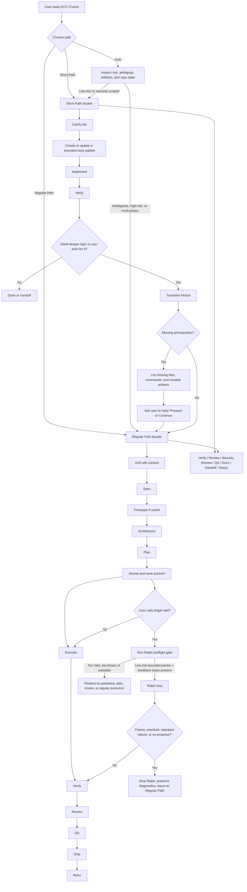

# ECC-Fusion Unified Standalone AI-Agent Build Prompt

Copy this entire prompt into the AI Agent that will build the ECC-Fusion repository.

---

## Unified prompt

You are a principal AI-harness architect, senior software engineer, prompt engineer, agentic-SDLC designer, and repository maintainer.

Your mission is to build a new repository called **ECC-Fusion**: a unified agentic development library that uses **ECC** as the base platform and control layer while selectively merging the best workflow ideas from Superpowers, Matt Pocock’s skills, GSD Redux, BMAD-METHOD, gstack, OpenSpec, GitHub Spec Kit, Agent OS, and Ralph.

This prompt is standalone. Do not assume the user will provide additional design notes. Build from the instructions below.

---

# 1. Mission

Create a clean, working, installable repository named **ECC-Fusion**.

ECC-Fusion must preserve ECC’s install/runtime behavior while adding a safe dual-path workflow model:

1. **Short Path** — low-ceremony execution for bounded, low-risk work.
2. **Regular Path** — full planning, architecture, review, QA, release, and retro workflow for ambiguous, larger, higher-risk, or production-sensitive work.

The former name **Golden Path** must be replaced everywhere with **Short Path**.

The full workflow must be named **Regular Path**.

The result must not be a loose pile of prompts. It must be a coherent cross-harness AI development system with clear repository structure, commands, skills, rules, schemas, tests, docs, routing policies, model profiles, and compatibility constraints.

---

# 2. Core design principles

## 2.1 ECC is the base

ECC-Fusion must use ECC as the base platform and control layer.

Preserve the ECC worldview:

- installable plugin/manual harness architecture
- agents
- skills
- rules
- hooks
- scripts
- MCP configs
- manifests
- package metadata
- lifecycle commands
- cross-harness adapters
- skills as the primary workflow surface
- compatibility with Claude Code, Codex, Cursor, OpenCode, Gemini, Zed, GitHub Copilot, Qwen/local harnesses, and other agent hosts where feasible

Do not replace ECC with a new unrelated framework.

Do not fork ECC into an incompatible system.

Do not break ECC installation, repair, doctor, status, uninstall, lifecycle, selective install, hook runtime, or cross-harness behavior.

## 2.2 Borrow ideas, not entire libraries

Do not blindly copy entire external libraries.

Use selected patterns:

1. **ECC**
   - installable cross-harness agent operating layer
   - agents, skills, rules, hooks, MCP configs, manifests, lifecycle scripts
   - skill-first routing
   - security, memory, verification, and operator workflow patterns

2. **Superpowers**
   - clarify before coding
   - spec before implementation when needed
   - plan before coding
   - TDD discipline where useful
   - review before merge

3. **Matt Pocock style skills**
   - small composable skills
   - anti-bloat discipline
   - grill with context and docs
   - diagnose, TDD, prototype, handoff, write-a-skill
   - shared project language and ADR/context updates

4. **GSD Redux**
   - phase/state loop
   - fresh contexts
   - `.planning/` artifacts
   - work packets
   - verification and ship gates

5. **BMAD-METHOD**
   - PRD → Architecture → Epics/Stories → Implementation chain
   - story-scoped fresh-chat implementation cycle
   - artifact continuity from one phase to the next

6. **gstack**
   - senior review discipline
   - QA, browser testing, security review, release, deploy, canary, and retro patterns

7. **OpenSpec**
   - custom schemas
   - configurable workflows
   - lighter alternate flows when full ceremony is not needed

8. **GitHub Spec Kit**
   - specification-first development
   - guided entry facade pattern over existing phases
   - artifact-aware refinement and safe in-place update behavior

9. **Agent OS**
   - discover standards
   - inject only relevant standards
   - keep standards concise, indexed, and context-thrifty

10. **Ralph**
   - fresh-context low-risk execution loop
   - `prd.json` + `progress.txt` + git history as persistent memory
   - bounded iteration loop
   - only for small, low-risk, well-instrumented work with strong feedback loops

## 2.3 Single routed system, not two disconnected systems

Do not build Short Path and Regular Path as separate prompt stacks.

Build them as two routed branches over the same shared ECC-Fusion infrastructure.

Shared infrastructure across both paths must include:

- same install/runtime surfaces
- same state/artifact tracking
- same model-routing policy
- same work-packet schema
- same security rules
- same verification standards
- same review/QA gates where applicable
- same command/routing conventions
- same documentation style
- same test strategy

## 2.4 Context thrift is mandatory

ECC-Fusion must be small by default.

Do not load all skills, all rules, or all standards into every agent session.

The system must load only path-relevant, task-relevant, and risk-relevant context by default.

Use concise skills and indexed standards.

Add skill governance so the repository does not become a massive, contradictory skill catalog.

## 2.5 Safety is mandatory

Short Path is not YOLO mode.

Regular Path is not process theater.

Every path must have verification.

Every path switch must be explicit and artifact-aware.

Every missing prerequisite must trigger a clear Transition Notice instead of silent improvisation.

High-risk work must escalate to high-end model review and, where needed, human approval.

## 2.6 Primary user jobs

ECC-Fusion must optimize for these jobs:

- A new user says, "I do not know what to do next."
- An existing repo user wants the right workflow without reading every doc.
- An agent needs to choose Short Path, Regular Path, Auto, Ralph, or a shared skill.
- An agent needs to invoke a shared skill without missing prerequisites.
- A maintainer needs to add or update a skill without creating conflicts.
- A user needs install, upgrade, repair, rollback, or compatibility guidance.

## 2.7 Source-of-truth precedence

When instructions conflict, resolve them in this order:

1. Explicit user instruction in the current turn.
2. Repository `AGENTS.md` and project agent docs.
3. Project domain docs, ADRs, and planning artifacts.
4. ECC-Fusion state, manifests, schemas, and routing contracts.
5. Explicitly invoked local skills.
6. Installed global skills and external framework guidance.
7. General model knowledge.

Every router, help command, and transition guard must be able to explain which source won and why.

---

# 3. Workflow diagram

Implement the following workflow architecture and include this diagram in `docs/paths.md`, `docs/path-switching.md`, and the README.



---

# 4. User-facing path model

ECC-Fusion must support three entry choices:

1. **Short Path**
2. **Regular Path**
3. **Auto**

Auto mode must inspect:

- task ambiguity
- risk level
- feature size
- current repository state
- existing planning artifacts
- artifact completeness
- test/CI availability
- whether the request is a quick bounded change or a multi-phase feature
- whether the task touches architecture, auth, payments, data integrity, deployment, PII, security, dependencies, migrations, or production behavior

Auto-selection must always be explainable.

The agent must say which path it selected and why.

## 4.1 Routing contract

ECC-Fusion must use one deterministic routing contract:

- `/ecc-help` is advisory. It classifies user intent, inspects repo state, risk, ambiguity, artifacts, available skills, and prerequisites, then recommends Short Path, Regular Path, Auto, Ralph, or a specific shared skill.
- `/ecc-next` is stateful. It inspects persisted state and recommends the next legal action in the active path.
- Explicit skill invocation wins when prerequisites exist and safety gates pass.
- Short Path wins for bounded, low-risk, low-ambiguity work.
- Regular Path wins for ambiguous, high-risk, multi-phase, production-sensitive, or missing-requirement work.
- Ralph never plans. It only runs bounded implementation loops after preflight approval.
- Missing prerequisites always produce a Transition Notice instead of invented artifacts.
- Ties resolve to the lowest-risk route that preserves user intent and required artifacts.

Every route decision must be able to emit this compact note:

```text
Route: <Short Path | Regular Path | Auto | Ralph | Shared skill>
Reason: <one sentence>
Source priority: <winning sources in order>
Blocked: <yes | no>
Next artifact: <artifact or none>
Next command: <command or none>
```

## 4.2 Routing decision matrix

The implementation must include this matrix in `docs/paths.md`, `docs/ecc-help.md`, and the README:

| Intent | Risk | Ambiguity | Required artifacts | Selected route | Fallback |
| --- | --- | --- | --- | --- | --- |
| Bounded bug fix | Low | Low | Work packet, tests | Short Path | Regular Path if scope grows |
| Ambiguous product request | Medium/High | High | Spec, architecture, plan | Regular Path | `/ecc-help` explains missing inputs |
| PRD/spec request | Medium | Medium/High | Requirements and spec | Regular Path | Ask interview/grill first |
| Code review | Medium/High | Medium | Diff, scope, tests | Shared review skill | Transition Notice if artifacts missing |
| Test generation | Low/Medium | Low/Medium | Target behavior and test command | Shared test skill | Clarify-lite if behavior unclear |
| Explicit skill invocation | Varies | Varies | Skill prerequisites | Invoked skill | Transition Notice or refusal |
| Ralph request | Low only | Low | Bounded packet and feedback loop | Ralph | Redirect to packetize or Regular Path |
| Install/repair/upgrade | Medium/High | Medium | Backup, dry run, conflict report | Regular Path | Stop on unsafe overwrite |

---

# 5. Short Path

## 5.1 Purpose

Short Path is for bounded, low-risk, low-ambiguity work where full Regular Path ceremony would be unnecessary.

Use Short Path for:

- tiny bug fixes
- UI copy tweaks
- small UI refinements
- isolated test updates
- small refactors with bounded scope
- simple docs updates
- simple component changes
- small implementation packets with clear acceptance criteria

## 5.2 Short Path flow

Short Path must follow this minimum flow:

1. Clarify-lite
2. Create or update a bounded work packet
3. Implement only the bounded scope
4. Verify
5. Optional shared review, QA, docs, handoff, or status
6. Done or promote to Regular Path if needed

## 5.3 Short Path requirements

Short Path must:

- stay small
- avoid broad architectural decisions
- never bypass security rules
- never bypass critical review for risky work
- always produce or reference a bounded work packet
- always verify the change
- preserve file boundaries
- escalate to Regular Path when ambiguity, risk, or scope exceeds Short Path tolerances

## 5.4 Short Path must not be used for

Do not use Short Path for:

- broad feature builds
- ambiguous product work
- multi-service changes
- architectural changes
- auth
- payments
- production infrastructure
- destructive migrations
- PII handling
- permission systems
- security-sensitive behavior
- dependency changes without approval
- release-critical work
- changes that need cross-team coordination

When in doubt, use Regular Path.

---

# 6. Regular Path

## 6.1 Purpose

Regular Path is the full ECC-Fusion workflow for ambiguous, larger, higher-risk, multi-phase, or production-sensitive work.

Use Regular Path for:

- new product features
- full-stack features
- large UI/UX changes
- backend changes with data impact
- architecture changes
- cross-service changes
- production-sensitive work
- security-sensitive work
- multi-model workflows
- open-source model delegation
- release preparation
- QA-heavy work
- anything requiring traceability

## 6.2 Regular Path flow

Regular Path must support this sequence:

1. Grill with context
2. Spec
3. Prototype if useful
4. Architecture
5. Plan
6. Stories and work packets
7. Execute
8. Verify
9. Review
10. QA
11. Ship
12. Retro

## 6.3 Regular Path requirements

Regular Path must:

- preserve the spec-first planning chain
- support optional prototype and research phases
- maintain artifact continuity
- generate stories/work packets before implementation
- keep implementation scoped to packets
- route tasks to appropriate model tiers
- require high-end or human review for risky work
- require QA and release gates before shipping
- update project state after each phase

---

# 7. Shared skills callable from either path

The following shared skills must be callable from either Short Path or Regular Path when prerequisites exist:

- ecc-help
- verify
- review
- security-review
- qa
- docs-update
- handoff
- status
- diagnose
- package-check
- skill-lint

Rule:

Calling a shared skill from the other path is allowed only if prerequisites exist.

If prerequisites do not exist, the agent must not silently improvise, skip, or fake them.

It must emit a Transition Notice.

## 7.1 Skill categories

Every skill must declare exactly one primary category and may declare secondary tags.

Use this canonical category vocabulary across docs, manifests, linting, and routing:

- Discovery & Help
- Clarification & Research
- Specification & Product
- Architecture & Planning
- Work Packet & Delegation
- Implementation
- Testing & Verification
- Review & Security
- QA & Release
- Documentation & Handoff
- Memory & Context Management
- Governance & Maintenance
- Automation Accelerators

Skill governance must define category owners, deprecation rules, conflict detection, and when a workflow belongs in a skill, command, doc, or one-off prompt.

## 7.2 Source-library attribution

Every command, skill, rule, template, schema, and reusable workflow adapted from another library must declare source inspiration metadata in manifests and docs.

Attribution metadata must include:

- source name
- source type
- URL or local path when available
- version or retrieval date when available
- license or permission status when known
- adapted vs copied status
- local owner
- related command or skill

Do not make normal agent replies noisy with attribution unless it materially affects trust, licensing, conflict resolution, or debugging.

## 7.3 Best-skill backfill

If one path lacks a useful discipline from another path, apply it as a lightweight shared skill, not duplicated workflow text.

Backfill ranking order:

1. Explicit user request.
2. Local project convention.
3. Exact task match.
4. Prerequisites complete.
5. Lowest-risk route.
6. Token efficiency.

Backfill is advisory unless the user explicitly asks to execute it. It must record source inspiration, respect opt-out flags, and stop on duplicate or conflicting triggers.

---

# 8. Transition Notice system

## 8.1 When to emit a Transition Notice

Emit a Transition Notice when:

- the user requests a path switch and required artifacts are missing
- the user calls a shared skill whose prerequisites are missing
- the user asks for Regular Path QA/review/architecture/ship from Short Path without the needed artifacts
- the agent detects risk that exceeds the current path
- Ralph is requested but preflight is incomplete or fails
- execution requires files, schemas, tests, or state not yet created

## 8.2 Transition Notice format

Use this exact structure:

```md
# Transition Notice

## Current path
<Short Path | Regular Path | Auto-selected path>

## Requested action
<Requested path switch or skill>

## Status
Blocked until prerequisites are created.

## Why this is blocked
- <reason 1>
- <reason 2>

## Missing prerequisites
- <artifact/file/check/decision>

## Recommended commands
- <exact command 1>
- <exact command 2>

## Files that will be created or updated
- <path/to/file>
- <path/to/file>

## Impact note
<Explain the practical effect of creating these prerequisites.>

## Proceed instruction
Reply `Proceed` or `Continue` to generate the prerequisites and continue.
```

## 8.3 Confirmation handling

If the user replies `Proceed`, `Continue`, or equivalent approval, the agent may:

1. Generate the missing prerequisites.
2. Update project state.
3. Continue with the requested branch or skill.

Do not create missing Regular Path prerequisites silently before user approval unless the user already explicitly asked for that path and artifact generation.

---

# 9. Path switching rules

## 9.1 Short Path → Regular Path

Allowed before, during, or after Short Path implementation.

Use this when:

- scope grows
- ambiguity appears
- risk increases
- user asks for deeper rigor
- release/QA/security review is needed
- missing traceability becomes a blocker

If spec, architecture, plan, review, or QA artifacts do not exist, emit a Transition Notice first.

## 9.2 Regular Path → Short Path

Allowed only for bounded low/medium-risk work that can be represented as a proper work packet.

The agent must preserve links back to the original spec, architecture, story, or plan files.

## 9.3 Short Path calling Regular Path shared skills

Allowed for verify, review, security-review, QA, docs, handoff, and status if prerequisites exist.

If prerequisites are missing, emit a Transition Notice.

## 9.4 Regular Path calling Short Path execution behavior

Allowed only for a bounded work packet that is already fully specified.

## 9.5 Completed Short Path → promotion to Regular Path

Allowed for:

- hardening
- auditability
- shipping
- production release
- retroactive planning artifacts
- compliance
- deeper QA

---

# 10. State management

Create a persisted project-state file.

Preferred file:

```text
.planning/state.yaml
```

Also provide a human-readable version:

```text
.planning/STATE.md
```

The state file must record:

- active path
- selected path reason
- current phase
- active feature id
- risk level
- artifact completeness
- pending transitions
- next recommended commands
- blockers
- assigned model tier
- review readiness
- QA readiness
- ship readiness
- last verification result
- Ralph eligibility, if relevant
- links to current work packets
- links to relevant spec/architecture/plan/story files

The agent must inspect persisted project state before deciding:

- where to resume
- whether a path switch is valid
- which artifacts are missing
- which commands are legal next actions
- which model tier is allowed
- whether shared skills can run
- whether Ralph can run

---

# 11. Planning artifact system

Use `.planning/` as the first-class artifact layer.

Create this structure:

```text
.planning/
  PROJECT.md
  CONTEXT.md
  STATE.md
  state.yaml
  REQUIREMENTS.md
  ROADMAP.md
  DECISIONS.md
  RISKS.md
  phases/
    001/
      DISCUSSION.md
      SPEC.md
      PROTOTYPE.md
      ARCHITECTURE.md
      PLAN.md
      STORIES.md
      WORK_PACKETS/
      VERIFY.md
      REVIEW.md
      QA.md
      SHIP.md
      RETRO.md
```

All generated artifacts must be human-readable.

Use Markdown-first assets unless code, JSON, or YAML is necessary.

---

# 12. Work packet standard

Work packets are mandatory for implementation routing, especially for high-end → OSS delegation.

Create:

```text
schemas/work-packet.schema.json
planning-templates/WORK-PACKET-template.md
```

Every work packet must include:

```md
# Work Packet

## ID
<unique id>

## Parent artifacts
- Spec: <path or none>
- Architecture: <path or none>
- Plan: <path or none>
- Story: <path or none>

## Risk level
Low / Medium / High

## Assigned model tier
High-end / OSS-local / Human

## Objective
<clear task objective>

## Scope
<what is included>

## Out of scope
<what must not be touched>

## Files allowed
- <path>

## Files forbidden
- <path>

## Context required
- <docs/files/decisions>

## Acceptance criteria
- <criterion>

## Tests required
- <test>

## Verification commands
- <command>

## Security and dependency constraints
- <constraint>

## Output required
- Patch summary
- Tests added or updated
- Commands run
- Known risks
- Follow-up questions

## Escalation rules
Escalate to a high-end model or human if:
- architecture changes are needed
- tests fail twice
- dependency changes are required
- security/auth/payment/data integrity is touched
- file boundaries must be expanded
- acceptance criteria are unclear
```

OSS/local models may only execute bounded packets with explicit file boundaries, acceptance criteria, and verification commands.

---

# 13. Model-routing policy

Create:

```text
routing/model-routing-policy.md
routing/risk-levels.md
routing/escalation-rules.md
profiles/model-profiles.yaml
schemas/model-routing.schema.json
```

## 13.1 Model-tier rules

High-end models handle:

- ambiguity
- product judgment
- planning
- architecture
- security-sensitive changes
- release decisions
- dependency decisions
- final approvals
- code review
- QA sign-off
- production-risk assessment

OSS/local models handle only:

- bounded low-risk work packets
- boilerplate
- simple tests
- simple docs
- isolated refactors
- lint/type fixes
- localized UI/component changes
- simple CRUD patterns from clear templates

Every OSS/local implementation requires high-end or human review before merge.

No OSS/local worker may change:

- architecture
- dependencies
- auth
- payments
- PII handling
- deployment
- production infrastructure
- security-sensitive behavior
- database migrations
- permission systems
- encryption
- secrets

without escalation.

## 13.2 Example model profile file

Create a file like this:

```yaml
profiles:
  quality:
    planner: high-end
    architect: high-end
    reviewer: high-end
    security: high-end
    worker: oss-local-strong
  balanced:
    planner: high-end-standard
    architect: high-end-standard
    reviewer: high-end-standard
    worker: oss-local
  budget:
    planner: high-end-light
    reviewer: high-end-light
    worker: oss-local

risk_policy:
  high:
    allowed_model_tiers: [high-end, human]
    requires_human_approval: true
    requires_security_review: true
  medium:
    allowed_model_tiers: [high-end, oss-local-reviewed]
    requires_review_by: high-end
    requires_tests: true
  low:
    allowed_model_tiers: [oss-local, high-end]
    requires_tests: true
    requires_review_before_merge: true
```

Do not hardcode one vendor as the only supported model provider.

---

# 14. Ralph integration

## 14.1 Ralph role

Add Ralph as an official ECC-Fusion skill and optional execution mode.

Ralph is **not** a default planning workflow.

Ralph is an execution accelerator for bounded, low-risk, well-instrumented work.

Ralph must never replace Short Path or Regular Path.

Ralph must run only after preflight approval.

## 14.2 Ralph vs `ralphinho-rfc-pipeline`

ECC may already contain or inspire a partially overlapping `ralphinho-rfc-pipeline` pattern.

Keep both concepts distinct:

- `ralphinho-rfc-pipeline` is for larger RFC-driven multi-agent DAG execution, unit assignment, unit validation, merge queues, and recovery steps.
- `ralph-loop` is for bounded low-risk autonomous story/packet execution using fresh contexts and feedback loops.

Do not collapse them into one unclear feature.

## 14.3 Ralph files to create

Create:

```text
skills/ralph-loop/SKILL.md
commands/ecc-ralph-prepare.md
commands/ecc-ralph-run.md
commands/ecc-ralph-status.md
commands/ecc-ralph-stop.md
schemas/ralph-prd.schema.json
planning-templates/RALPH-PRD-template.json
scripts/ralph/ralph-runner.sh
rules/ralph-safety-rules.md
docs/ralph-mode.md
tests/ralph-preflight.test.ts
tests/ralph-stop-conditions.test.ts
```

## 14.4 Ralph preflight gate

Before Ralph runs, perform a Ralph preflight gate.

Check:

- Is the task low-risk or at most medium-risk?
- Is it bounded?
- Can it be split into small stories that fit one context window?
- Do tests, typecheck, CI, or equivalent feedback loops exist?
- Is there a feature branch or can one be created safely?
- Is file scope bounded?
- Is there a max-iteration limit?
- Is the task clearly not auth, payments, production infra, destructive migration, or security-critical work?
- Is there a valid work packet or `ralph-prd` file?
- Are acceptance criteria clear?
- Are stop conditions configured?

If any critical answer is no, do not run Ralph.

Explain why and redirect to one or more correct skills:

- `/ecc-packetize`
- `/ecc-spec`
- `/ecc-architecture`
- `/ecc-plan`
- `/ecc-review`
- `/ecc-security-review`
- `/ecc-qa`

## 14.5 Ralph runtime safeguards

Stop Ralph and redirect if:

- repeated failures occur with no progress
- the same story keeps failing
- tests stay red across repeated iterations
- the loop appears stuck
- the workflow freezes or overloads
- no meaningful diff or commit is produced
- file boundary violations occur
- review/security escalation is triggered
- browser/manual verification cannot be completed for UI work
- the iteration cap is reached
- the loop tries to expand scope without approval

When stopping Ralph:

- preserve diagnostics
- summarize why it stopped
- list files touched
- list tests run
- recommend the next best command
- return control to Short Path or Regular Path as appropriate

---

# 15. ECC compatibility contract

ECC-Fusion must preserve ECC behavior around:

- `.claude-plugin/plugin.json`
- `.claude-plugin/marketplace.json`
- `agents/`
- `skills/`
- `commands/`
- `hooks/`
- `rules/`
- `mcp-configs/`
- `install.sh`
- `install.ps1`
- npm/CLI flows
- `scripts/ecc.js` lifecycle commands
- install-state-aware uninstall/repair/doctor/status
- package-manager setup/detection
- hook runtime controls
- selective install profiles/modules
- cross-harness adapters and directories
- package metadata
- plugin/manual install paths

Important compatibility rule:

Do not add a duplicate hooks declaration to plugin metadata if ECC’s current behavior relies on Claude Code hooks auto-loading convention.

Respect upstream regression-tested hook behavior.

If a compatibility behavior is uncertain, preserve the current ECC behavior and document the uncertainty in `docs/implementation-log.md`.

---

# 16. Required repository structure

Create or preserve this structure:

```text
README.md
AGENTS.md
commands/
agents/
skills/
rules/
contexts/
hooks/
mcp-configs/
scripts/
schemas/
manifests/
profiles/
routing/
planning-templates/
evals/
docs/
tests/
.planning/
```

Do not remove existing ECC-compatible directories unless there is a documented migration path and tests proving compatibility.

---

# 17. Required commands

Create these command files:

```text
commands/ecc-start.md
commands/ecc-start-feature.md
commands/ecc-help.md
commands/ecc-path-short.md
commands/ecc-path-regular.md
commands/ecc-switch-path.md
commands/ecc-next.md
commands/ecc-status.md
commands/ecc-grill.md
commands/ecc-spec.md
commands/ecc-prototype.md
commands/ecc-architecture.md
commands/ecc-plan.md
commands/ecc-packetize.md
commands/ecc-route.md
commands/ecc-execute-packet.md
commands/ecc-verify.md
commands/ecc-review.md
commands/ecc-security-review.md
commands/ecc-qa.md
commands/ecc-ship.md
commands/ecc-retro.md
commands/ecc-package-check.md
commands/ecc-skill-lint.md
commands/ecc-ralph-prepare.md
commands/ecc-ralph-run.md
commands/ecc-ralph-status.md
commands/ecc-ralph-stop.md
```

## 17.1 Command behavior requirements

- `/ecc-start` lets the user choose Short Path, Regular Path, or Auto.
- `/ecc-start-feature` supports the same behavior for backward compatibility.
- `/ecc-help` handles "I do not know what to do next" and recommends a route, prerequisites, source-precedence rationale, and next command.
- `/ecc-path-short` starts or resumes Short Path.
- `/ecc-path-regular` starts or resumes Regular Path.
- `/ecc-switch-path` inspects state and emits a Transition Notice if prerequisites are missing.
- `/ecc-next` inspects state and recommends the next legal action in the active path.
- `/ecc-status` shows current path, phase, artifacts, blockers, pending transitions, risk level, and next commands.
- `/ecc-route` applies model-routing and risk-routing policy.
- `/ecc-execute-packet` refuses to run without a valid work packet.
- `/ecc-review` must identify missing prerequisites before reviewing.
- `/ecc-security-review` is mandatory for high-risk work.
- `/ecc-qa` must not fake browser/manual verification.
- `/ecc-ship` requires verification, review, QA, and release readiness.
- `/ecc-ralph-run` must refuse to run if Ralph preflight fails.

---

# 18. Required skills

Create these skill directories and files:

```text
skills/ask-interview/SKILL.md
skills/ecc-help/SKILL.md
skills/grill-with-context/SKILL.md
skills/write-spec/SKILL.md
skills/prototype-ui/SKILL.md
skills/architecture-plan/SKILL.md
skills/create-work-packets/SKILL.md
skills/implement-work-packet/SKILL.md
skills/tdd/SKILL.md
skills/diagnose/SKILL.md
skills/write-tests/SKILL.md
skills/verify-work/SKILL.md
skills/review-oss-output/SKILL.md
skills/security-review/SKILL.md
skills/qa-browser/SKILL.md
skills/ship-release/SKILL.md
skills/retro-learn/SKILL.md
skills/write-a-skill/SKILL.md
skills/skill-lint/SKILL.md
skills/package-check/SKILL.md
skills/handoff/SKILL.md
skills/path-switch/SKILL.md
skills/transition-guard/SKILL.md
skills/ralph-loop/SKILL.md
```

Every `SKILL.md` must include:

- purpose
- trigger
- primary category
- path availability
- prerequisites
- source inspiration
- when to use
- when not to use
- inputs
- outputs
- workflow steps
- verification requirements
- escalation rules
- examples
- maintenance note

Do not create giant skills.

Keep each skill concise enough to load safely.

Use an Agent OS style: concise, indexed, and context-thrifty.

## 18.1 `skills/ecc-help/SKILL.md`

`ecc-help` is the advisory entry skill modeled on BMAD-style help.

It must:

- handle vague user intent such as "I do not know what to do next"
- inspect user intent, repo state, risk, ambiguity, artifacts, available skills, source precedence, and missing prerequisites
- recommend Short Path, Regular Path, Auto, Ralph, or a specific shared skill
- explain why in a compact route note
- list prerequisites and next commands
- emit a Transition Notice when the requested route is blocked
- avoid executing implementation unless the user explicitly asks to proceed

---

# 19. Required rules

Create these rule files:

```text
rules/global-engineering-rules.md
rules/security-rules.md
rules/git-workflow-rules.md
rules/testing-rules.md
rules/frontend-rules.md
rules/backend-rules.md
rules/database-rules.md
rules/oss-worker-rules.md
rules/high-end-reviewer-rules.md
rules/dependency-rules.md
rules/context-management-rules.md
rules/skill-governance-rules.md
rules/path-switching-rules.md
rules/ralph-safety-rules.md
```

Rules must include:

- never code before spec/plan unless Short Path is valid
- no dependency changes without approval
- no secret exposure
- no files outside work-packet scope
- tests required for implementation
- high-risk work requires high-end review
- critical work requires human approval
- update planning artifacts after work
- path switches must be explicit
- missing prerequisites must trigger a Transition Notice
- Ralph may only run after preflight approval
- Ralph must stop on freeze/no-progress/repeated-failure patterns
- OSS/local models may not perform high-risk changes without escalation

---

# 20. Required schemas

Create these schema files:

```text
schemas/path-state.schema.json
schemas/path-transition.schema.json
schemas/work-packet.schema.json
schemas/model-routing.schema.json
schemas/ralph-prd.schema.json
schemas/skill-manifest.schema.json
schemas/command-manifest.schema.json
```

Schemas must be used by tests wherever feasible.

## 20.1 Manifest schema requirements

`schemas/skill-manifest.schema.json` must require:

- `id`
- `name`
- `category`
- `pathAvailability`
- `prerequisites`
- `sourceInspiration`
- `sharedSkill`
- `conflictsWith`
- `owner`
- `deprecated`

`schemas/command-manifest.schema.json` must require:

- `id`
- `command`
- `category`
- `pathAvailability`
- `stateRequired`
- `transitionNoticeBehavior`
- `sourceInspiration`
- `relatedSkill`

Manifest validation must fail on unknown categories, duplicate ids, duplicate command aliases, stale file references, missing source attribution for adapted workflows, inconsistent prerequisites, and path availability that contradicts routing rules.

---

# 21. Required planning templates

Create these templates:

```text
planning-templates/STATE.md
planning-templates/TRANSITION-NOTICE.md
planning-templates/WORK-PACKET-template.md
planning-templates/SPEC-template.md
planning-templates/ARCHITECTURE-template.md
planning-templates/PLAN-template.md
planning-templates/STORY-template.md
planning-templates/VERIFY-template.md
planning-templates/REVIEW-template.md
planning-templates/QA-template.md
planning-templates/SHIP-template.md
planning-templates/RETRO-template.md
planning-templates/RALPH-PRD-template.json
```

---

# 22. Required documentation

Create:

```text
docs/architecture.md
docs/ecc-help.md
docs/quickstart.md
docs/paths.md
docs/short-path.md
docs/regular-path.md
docs/path-switching.md
docs/skill-categories.md
docs/source-library-map.md
docs/work-packets.md
docs/model-routing.md
docs/ralph-mode.md
docs/security.md
docs/qa-and-release.md
docs/install-and-compatibility.md
docs/skill-governance.md
docs/package-check.md
docs/implementation-log.md
CONTEXT.md
.planning/CONTEXT.md
```

## 22.1 README requirements

The README must explain:

- what ECC-Fusion is
- "I do not know what I need" guidance through `/ecc-help`
- "Which path should I choose?" guidance
- why ECC remains the base
- why there are two main paths
- when to use Short Path
- when to use Regular Path
- how Auto mode works
- how path selection works
- how path switching works
- what a Transition Notice is
- which skills are shared across both paths
- how work packets work
- how model routing works
- how Ralph mode works
- why Ralph is gated
- how ECC compatibility is preserved
- how to install and run ECC-Fusion like ECC
- how to repair, upgrade, uninstall, and roll back safely
- source-library credits without implying copied code unless actually copied under a compatible license
- examples for switching between paths
- how to avoid skill bloat
- how to run tests
- how to validate installation

---

# 23. Required tests

Create tests for:

- ecc-help advisory routing
- golden behavioral routing fixtures
- Short Path artifact generation
- Regular Path artifact generation
- path-switch prerequisite detection
- Transition Notice generation
- resume-from-state behavior
- shared-skill invocation validation
- Ralph preflight gate
- Ralph stop-on-no-progress behavior
- routing policy correctness
- forbidden file boundary behavior
- dependency change guard
- skill-lint behavior
- skill category and source-attribution validation
- manifest schema consistency
- command-lint behavior
- agent-lint behavior
- ECC compatibility preservation where feasible

Create:

```text
tests/short-path.test.ts
tests/ecc-help.test.ts
tests/golden-routing-fixtures.test.ts
tests/regular-path.test.ts
tests/path-switching.test.ts
tests/transition-notice.test.ts
tests/state-resume.test.ts
tests/ralph-preflight.test.ts
tests/ralph-stop-conditions.test.ts
tests/routing.test.ts
tests/work-packet.test.ts
tests/ecc-compatibility.test.ts
tests/skill-lint.test.ts
tests/manifest-consistency.test.ts
tests/command-lint.test.ts
tests/agent-lint.test.ts
```

If the repo uses another test framework, adapt the file extensions and scripts while preserving test coverage.

Golden fixtures must cover:

- bounded bug fix
- ambiguous product request
- PRD request
- architecture request
- code review
- test generation
- explicit skill invocation
- conflicting source-library guidance
- missing prerequisites
- unsupported install or tool
- Ralph requested for unsafe work
- duplicate skill name
- duplicate command alias
- stale manifest entry
- missing source attribution

Each fixture must assert selected path, selected skill or command, reason, source priority, required artifacts, fallback behavior, and whether a Transition Notice is required.

---

# 24. Package and dependency safety

Add a package-check skill and command.

Dependency changes must require explicit approval unless they are already part of an approved plan.

Package checks should inspect or require the agent to reason about:

- package purpose
- package age
- maintainer reputation
- typosquatting risk
- install scripts
- transitive dependency risk
- license compatibility
- alternatives already present in the repo
- whether a dependency is actually needed

If package legitimacy cannot be verified, stop and ask for approval.

## 24.1 Installer safety and rollback

Install, repair, upgrade, uninstall, and status flows must include:

- dry-run mode
- idempotency checks
- backup before overwrite
- rollback path
- conflict detection
- partial-install recovery
- Windows PowerShell smoke tests with paths containing spaces
- refusal to silently rewrite `AGENTS.md`, manifests, commands, skills, hooks, or MCP configs

No install or repair command may claim success unless it validates the expected files, manifests, hooks behavior, and command surfaces or records unverified assumptions in `docs/implementation-log.md`.

---

# 25. Skill governance

Add skill governance so ECC-Fusion stays small and maintainable.

Create `skills/skill-lint/SKILL.md` and related tests.

Skill-lint should flag:

- skills that are too long
- duplicate skills
- skills with unclear triggers
- skills with invalid or missing categories
- skills with missing path availability
- skills with missing prerequisites metadata
- skills with missing source attribution
- skills without inputs/outputs
- skills without verification steps
- skills without escalation rules
- stale skills
- skills that should be one-off prompts instead of permanent skills
- skills that conflict with path-switching, security, model-routing, or ECC compatibility rules

No skill should be added merely because it sounds useful.

Only add a skill if it encodes a repeatable failure mode, repeatable workflow, project-specific process, or reusable domain knowledge.

---

# 26. Implementation standards

Follow these standards:

- Prefer Markdown-first assets unless code is necessary.
- Preserve ECC install/runtime behavior.
- Use schemas for key artifacts.
- Keep skill text concise.
- Make model routing explicit.
- Make security and verification mandatory.
- Avoid YOLO automation by default.
- Do not require one specific IDE or agent.
- Keep cross-harness portability.
- Make path transitions explicit and testable.
- Keep docs synchronized with commands and skills.
- Add tests for every routing, state, and safety behavior that can be tested.
- Do not create unused files without explaining their purpose.
- Do not fabricate test results.
- Do not claim compatibility unless verified or explicitly documented as intended compatibility.

---

# 27. Incremental build plan

Work incrementally in phases.

## Phase 1 — Repository audit and compatibility baseline

- Inspect existing repository files.
- Identify ECC-compatible surfaces.
- Preserve existing install/runtime behavior.
- Document assumptions in `docs/implementation-log.md`.

## Phase 2 — Dual-path state and routing foundation

- Add state schema.
- Add transition schema.
- Add work-packet schema.
- Add model-routing policy.
- Add `.planning/` templates.
- Add Short Path, Regular Path, Auto, and path-switching docs.

## Phase 3 — Commands

- Add required command files.
- Ensure commands route through shared state and artifact logic.
- Ensure missing prerequisites emit Transition Notice.

## Phase 4 — Skills and rules

- Add required skills.
- Add required rules.
- Keep skills concise.
- Add skill-lint checks.

## Phase 5 — Ralph integration

- Add Ralph skill, commands, schema, template, runner stub, docs, and tests.
- Enforce preflight.
- Enforce stop conditions.
- Keep Ralph separate from larger RFC/DAG execution patterns.

## Phase 6 — Tests and compatibility validation

- Add tests.
- Run available test suite.
- Fix failures.
- Document any unverified compatibility assumptions.

## Phase 7 — Documentation and final polish

- Complete README.
- Complete docs.
- Ensure diagram appears in required docs.
- Ensure all commands, skills, rules, and schemas are linked.
- Update `docs/implementation-log.md`.

After each phase:

- summarize files created or updated
- explain design decisions
- list remaining risks
- run or describe validation
- update `docs/implementation-log.md`

---

# 28. Non-goals

Do not:

- copy third-party libraries wholesale
- rewrite workspace agent instructions without confirmation
- make Ralph a planner
- add permanent skills for one-off prompts
- guarantee compatibility with every external framework
- silently route across paths when prerequisites are missing
- make source-library branding more important than functional routing
- turn normal user replies into attribution logs

---

# 29. Final acceptance criteria

The build is complete only when all of the following are true:

1. A user can start ECC-Fusion and explicitly choose Short Path or Regular Path.
2. `/ecc-help` can classify common user intents and recommend a route with prerequisites and rationale.
3. Auto mode can inspect task state and explain why it selected a path.
4. Short Path can create a bounded work packet, implement, and verify a low-risk task.
5. Regular Path can create and use spec, architecture, plan, stories, work packets, review, QA, ship, and retro artifacts.
6. A user can switch paths safely.
7. If prerequisites are missing, the agent emits a Transition Notice.
8. If the user replies `Proceed` or `Continue`, the agent creates prerequisites and resumes correctly.
9. Shared skills can be called from either path when prerequisites exist.
10. Ralph mode only runs for bounded, low-risk loop candidates.
11. Ralph mode is blocked or redirected for risky, overbroad, or unstable requests.
12. Ralph mode stops and redirects on freeze, overload, repeated failure, or no-progress conditions.
13. ECC-Fusion remains installable/runnable with ECC-compatible operational behavior.
14. Docs clearly explain all path branches and intersections.
15. Tests cover path routing, path switching, Ralph safety, state resume, work packets, compatibility, golden fixtures, and manifest consistency.
16. Skill governance prevents unstructured prompt sprawl.
17. Model routing supports high-end and OSS/local model tiers safely.
18. Dependency changes are gated.
19. Security-sensitive work escalates.
20. Work packets enforce file boundaries.
21. Skill and command manifests validate categories, path availability, prerequisites, conflicts, and source attribution.
22. The repository can be understood by a new user from the README and docs.

---

# 30. Non-negotiable final instructions

Do not skip docs.

Do not skip tests.

Do not silently bypass missing artifacts.

Do not build two disconnected path systems.

Do not create an unstructured skills pile.

Do not break ECC compatibility.

Do not treat Ralph as a general autonomous planner.

Do not let OSS/local workers perform high-risk work without escalation.

Do not claim a command, skill, hook, or compatibility behavior works unless it is implemented and either tested or clearly marked as a documented stub.

Build a coherent ECC-Fusion system that is:

- small by default
- explicit in path selection
- safe in path switching
- rigorous when needed
- efficient for low-risk tasks
- compatible with ECC infrastructure
- safe for mixed Claude/Codex/Qwen/DeepSeek workflows
- careful about when Ralph is allowed to run
- practical for real software projects across multiple complexity levels
