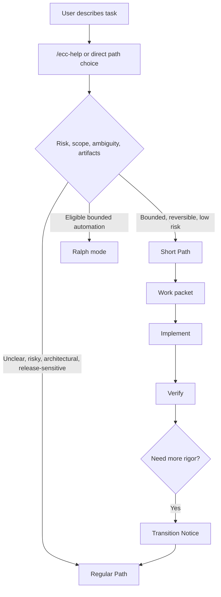

# ECC-Fusion

## What ECC-Fusion Is

ECC-Fusion is an ECC-based agentic development library for spec-driven AI coding. It keeps ECC as the install/runtime/control base, then maps useful ideas from BMAD-METHOD, Superpowers, Matt Pocock skills, GitHub Spec Kit, OpenSpec, GSD Redux, Agent OS, gstack, and Ralph into one routed lifecycle.

## Harness Ecosystem

The Harness Ecosystem is the backbone that powers and regulates paths, phases, skill relations, orchestration commands, workflow rules, planning artifacts, and validation. Its machine-readable control file is `manifests/harness.json`; its human-readable generated catalog is `ecosystem/`.

Do not move canonical executable skills out of `skills/` or executable commands out of `commands/`. Category folders under `ecosystem/skills/` are generated mirrors for traceability, not the runtime source of truth.

## I Do Not Know What I Need

Use `/ecc-help` when the next step is unclear. It recommends a route, phase, next artifact, and next command, then stops with a Transition Notice when blocked.

## First-Run Decision Diagram



## Which Path Should I Choose?

- Use Short Path for bounded, low-risk, low-ambiguity work.
- Use Regular Path for ambiguous, high-risk, multi-phase, production-sensitive, security-sensitive, or release-sensitive work.
- Use Auto mode when ECC-Fusion should inspect path selection criteria.

## Why ECC Remains The Base

ECC remains the base platform for agents, skills, commands, manifests, hooks, install behavior, repair behavior, and cross-harness compatibility.

## Two Main Paths

The two main paths are Short Path and Regular Path. Auto mode selects between them by inspecting risk, ambiguity, state, and artifact completeness.

## Phase Map

Both paths use one lifecycle: Orient, Scope, Specify, Design, Plan, Build, Verify, Release, and Learn. See `docs/path-phase-map.md` for the phase/subphase table and skill matrix.

## Path Selection

Path selection uses user intent, repository instructions, planning artifacts, ECC-Fusion state, explicit skills, global skills, and general model knowledge in that source-precedence order.

## Path Switching

Path switching must be explicit. Missing prerequisites produce a Transition Notice before any artifacts are created.

## Transition Notice

A Transition Notice explains the requested action, why it is blocked, missing prerequisites, recommended commands, files that will change, and the proceed instruction.

## Shared Across Both Paths

Shared skills can run from both paths only when prerequisites exist. Examples include verification, review, security review, package check, handoff, and `/ecc-help`.

## Kiro Planning Artifacts

Regular Path uses Kiro-style visible planning artifacts to keep the developer in sync with agent work: `requirements.md`, `design/`, `tasks.md`, and `qa-tasks.md`. Templates live in `planning-templates/kiro-spec/`.

## Work Packets

Work packets define objective, scope, allowed files, forbidden files, acceptance criteria, tests, verification commands, and escalation rules.

## Model Routing

Model routing assigns high-end, OSS/local, or human tiers based on risk. The ECC Harness standardizes prompts, artifacts, memory shape, verification gates, and fallback behavior; it does not make small models equal to premium models on high-ambiguity work.

## Ralph Mode

Ralph mode is a bounded execution accelerator for low-risk work with strong feedback loops.

## Why Ralph Is Gated

Ralph is gated because it is not a planner and must stop on freeze, overload, repeated failure, or no-progress patterns.

## ECC Compatibility

ECC-Fusion must preserve ECC-compatible install, repair, doctor, status, uninstall, lifecycle, selective install, hook runtime, and cross-harness behavior.

## Install

Install behavior must support dry run, conflict detection, backups before overwrite, and Windows paths with spaces.

## Repair

Repair must be idempotent and must not silently rewrite agent instructions, manifests, hooks, commands, or skills.

## Upgrade

Upgrade must detect conflicts, preserve user changes, and provide rollback.

## Uninstall

Uninstall must remove only managed ECC-Fusion surfaces and preserve user-owned project files.

## Roll Back

Roll back uses backups and implementation logs to restore the previous known-good state.

## Source-Library Credits

Source-library credits are documented in `docs/source-library-map.md`. Attribution means inspired by unless copied code and license compatibility are explicitly stated.

## Examples For Switching Paths

Short Path can promote to Regular Path when scope or risk grows. Regular Path can delegate bounded work packets to Short Path-style execution.

## Avoid Skill Bloat

Add a skill only for repeatable workflows, repeatable failure modes, project-specific processes, or reusable domain knowledge.

## Future Modifications

Before changing or adding a skill, identify its phase, category, source inspiration, path availability, prerequisites, conflicts, evidence requirements, and escalation rules. Regenerate `ecosystem/` and run the validation gates so the Harness Ecosystem stays coherent.

## Documentation Map

- `docs/harness-ecosystem.md`: harness backbone and integrity rules.
- `docs/kiro-planning-artifacts.md`: visible requirements/design/tasks/qa-tasks planning model.
- `docs/path-phase-map.md`: canonical lifecycle, phase/subphase matrix, skill table, and promotion visuals.
- `docs/skill-extension-guide.md`: rules for modifying or adding skills without disrupting the ecosystem.

## Regenerate Ecosystem Catalog

```powershell
node scripts/generate-ecosystem-catalog.mjs
```

## Run Tests

```powershell
npm.cmd test
```

## Validate Installation

```powershell
npm.cmd run validate
```
