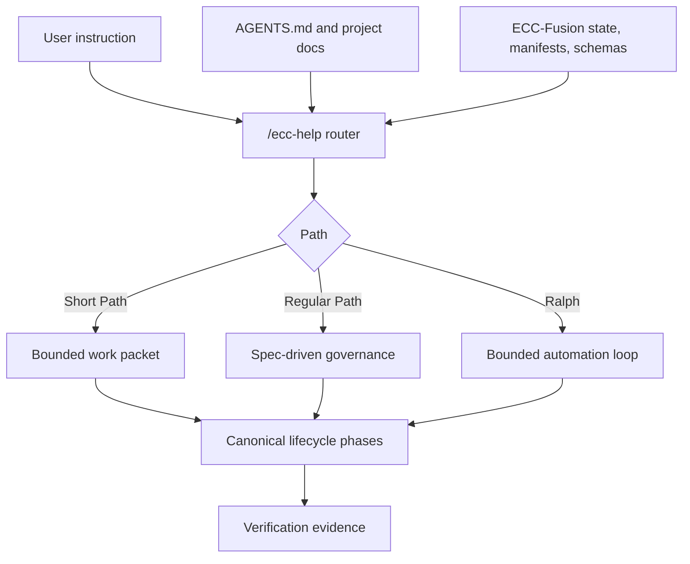

# Architecture

ECC-Fusion architecture is a routed lifecycle, not a bundle of independent methodologies. ECC remains the base platform and every borrowed source-library practice must map into the same path, phase, artifact, and validation contracts.

## Core Contracts

| Contract | Purpose |
| --- | --- |
| Path contract | Defines Short Path, Regular Path, Auto mode, and Ralph eligibility |
| Phase contract | Defines the canonical lifecycle and phase ownership |
| Artifact contract | Defines durable outputs and required fields |
| Escalation contract | Defines when Short Path must promote to Regular Path |
| Skill invocation contract | Prevents duplicate or conflicting skills |
| Model routing contract | Bounds model capability variance |
| Documentation contract | Treats docs as the user interface |

## System Shape



## Critical Design Decision

ECC-Fusion should fuse by normalization, not accumulation: normalize source-library ideas into phases, execution into work packets, safety movement into Transition Notices, and skill placement into stable categories.

## Validation

Run:

```powershell
npm.cmd test
npm.cmd run validate
```
