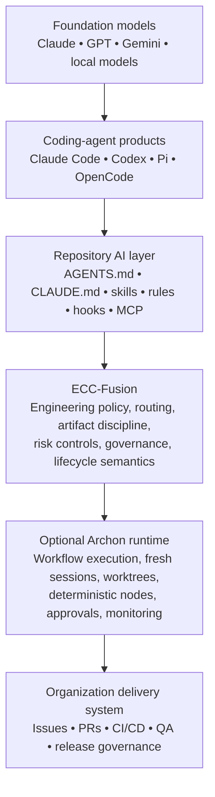
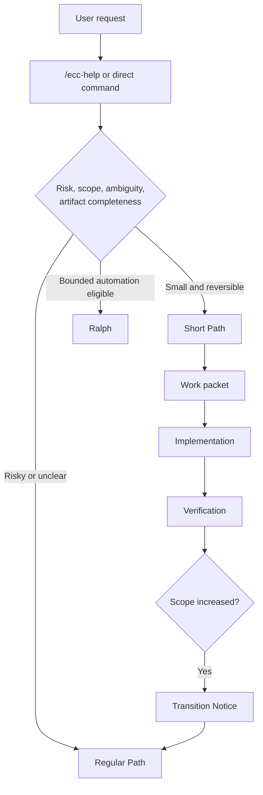
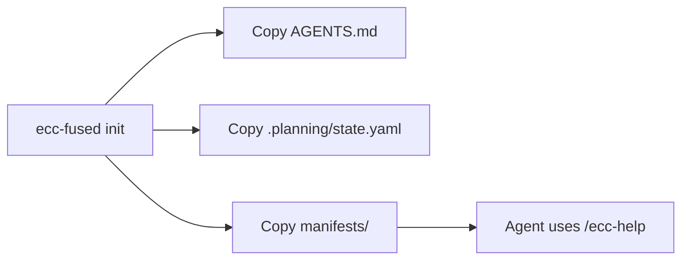
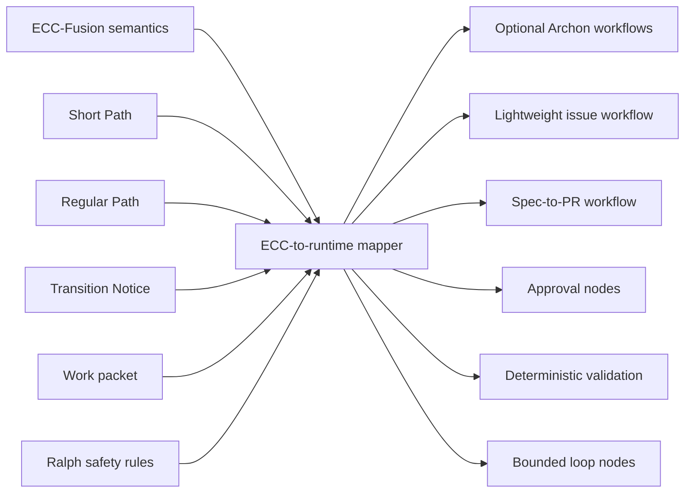
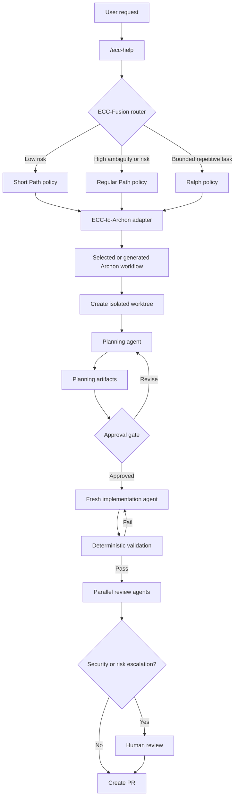
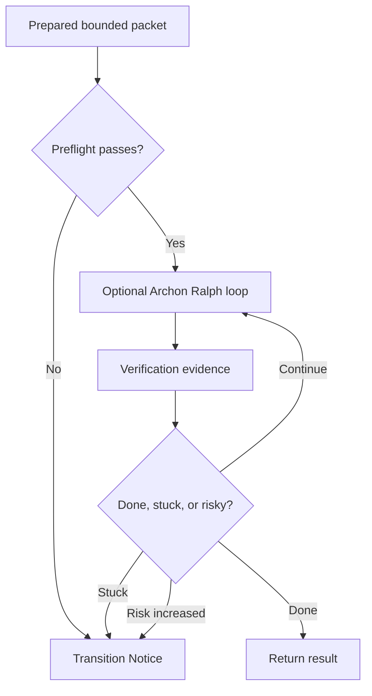
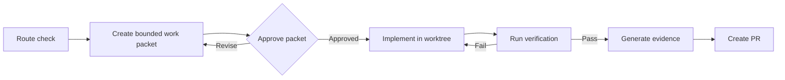

# ECC-Fusion and Archon Integration Strategy

**Status:** Proposed architecture decision  
**Last reviewed:** 2026-05-31

## Executive Decision

ECC-Fusion does **not** aim to recreate Archon.

ECC-Fusion owns the **engineering methodology and policy layer**: risk-adaptive routing, lifecycle semantics, planning artifacts, work packets, skill governance, model-tier policy, escalation rules, verification requirements, and cross-harness compatibility.

Archon may be supported as an **optional execution runtime**: DAG orchestration, isolated worktrees, multi-session execution, deterministic script nodes, human approval pauses, workflow logs, monitoring, and remote adapters.

ECC remains the compatibility and distribution base. Archon must not become a mandatory dependency for ECC-Fusion standalone usage.

```text
ECC-Fusion = engineering policy and methodology layer
Archon      = optional execution runtime
ECC         = compatibility and distribution base
Coding agent = reasoning worker
```

## Why This Boundary Matters

ECC-Fusion and Archon overlap in goals: both aim to make AI-assisted software development safer, more repeatable, and less dependent on ad hoc prompting. However, they currently solve different problems.

ECC-Fusion answers:

> What is the correct engineering process for this task?

Archon answers:

> How should a selected process execute reliably across agents, sessions, scripts, approvals, repositories, and pull requests?

The projects are complementary when ECC-Fusion defines **semantics** and Archon provides **mechanics**.

## Layer Model



Archon-backed execution is optional. A lightweight ECC-Fusion installation can continue to operate directly through compatible coding agents and explicit commands.

## ECC-Fusion's Unique Value

ECC-Fusion is a schema-backed, governed methodology distribution for agentic software development. Its core differentiators should remain first-class.

### Risk-Adaptive Routing

ECC-Fusion distinguishes between fast bounded work, governed specification-driven work, advisory routing, and bounded autonomous loops.



### Visible Planning Artifacts

Regular Path uses visible Kiro-style planning artifacts:

```text
.planning/specs/<feature-slug>/
├── requirements.md
├── design/
├── tasks.md
└── qa-tasks.md
```

These files make the agent's understanding, architecture, implementation plan, testing expectations, and QA evidence visible and traceable.

### Work-Packet Boundaries

Work packets define:

- objective;
- scope;
- allowed files;
- forbidden files;
- acceptance criteria;
- tests;
- verification commands;
- escalation rules.

These boundaries reduce blast radius before implementation begins.

### Transition Notices

A Transition Notice should explain:

- the requested action;
- why execution is blocked;
- missing prerequisites;
- recommended next commands;
- files that may change;
- the instruction required to proceed.

### Skill Governance

ECC-Fusion owns the taxonomy, manifests, schemas, validation rules, provenance, path availability, prerequisites, conflicts, and anti-bloat discipline for its skills and commands.

## What Archon Can Provide

Archon is a workflow engine and harness builder for AI coding agents. Its runtime features are useful integration targets rather than features ECC-Fusion should independently rebuild.

| Archon runtime capability | ECC-Fusion integration value |
| --- | --- |
| YAML DAG workflows | Execute ECC-Fusion paths as repeatable pipelines |
| Fresh agent sessions | Keep planning, implementation, and review contexts focused |
| Git worktree isolation | Run tasks safely in parallel without branch collisions |
| Deterministic bash or script nodes | Guarantee tests, linting, package checks, and validation run |
| Human approval gates | Implement Transition Notices and explicit progression approvals |
| Parallel reviewers | Run correctness, security, simplicity, and QA review concurrently |
| Workflow logs and monitoring | Provide evidence, observability, and debugging |
| CLI and remote adapters | Invoke ECC-Fusion-backed workflows from supported interfaces |

## Side-by-Side Comparison

| Dimension | ECC-Fusion | Archon | Relationship |
| --- | --- | --- | --- |
| Primary purpose | Govern how agents should work | Execute agent workflows reliably | Complementary |
| Core abstraction | Paths, phases, skills, commands, manifests, artifacts | YAML DAGs, nodes, dependencies, loops, approvals | Different |
| Risk classification | Central design principle | Can be encoded in workflows | ECC-Fusion owns policy |
| Short vs. rigorous work | Explicit Short Path and Regular Path | Multiple workflows may be authored | ECC-Fusion selects route |
| Transition Notices | Explicit escalation contract | Approval, branch, or cancellation mechanics | ECC-Fusion defines; runtime enforces |
| Planning artifacts | Opinionated Kiro-style files | Artifact passing | ECC-Fusion defines schema |
| Runtime execution | Lightweight standalone command-driven mode | Core strength | Optional delegation |
| Fresh sessions | Methodologically encouraged | Runtime feature | Archon-backed implementation |
| Parallel work | Not a standalone ECC-Fusion runtime feature | Core runtime capability | Do not reimplement |
| Worktree isolation | Not a standalone ECC-Fusion runtime feature | Core runtime capability | Do not reimplement |
| Dashboard | Not an ECC-Fusion goal | Core runtime capability | Reuse when needed |
| Skill governance | Core ECC-Fusion strength | Workflow-authoring focus | ECC-Fusion owns policy |
| Cross-harness compatibility | Explicit ECC-Fusion requirement | Archon-specific runtime | Preserve optionality |
| Ralph | Gated safety policy | Executable loop workflow | ECC-Fusion wraps runtime safely |

## Current ECC-Fusion Runtime Scope

ECC-Fusion currently provides a lightweight standalone operating model:



The existing CLI initializes ECC-Fusion project context and manifests. Commands and skills guide compatible coding agents through the lifecycle. This is intentionally lighter than a persistent DAG execution engine.

ECC-Fusion should preserve this standalone mode for developers who value:

- minimal infrastructure;
- explicit manual control;
- cross-agent portability;
- repository-local context;
- compatibility with ECC surfaces;
- no mandatory orchestration service.

## Reinvention Guardrails

ECC-Fusion should not independently build a second general-purpose Archon-style runtime unless a future requirement cannot be met through integration.

| Potential feature | Default decision |
| --- | --- |
| General-purpose YAML DAG engine | Integrate or reuse Archon |
| Multi-session scheduler | Integrate or reuse Archon |
| Worktree manager | Integrate or reuse Archon |
| Parallel node execution | Integrate or reuse Archon |
| Deterministic script-node runtime | Integrate or reuse Archon |
| Generic approval runtime | Map ECC-Fusion approvals to Archon nodes |
| Monitoring dashboard | Reuse Archon where appropriate |
| Remote Slack, Telegram, or GitHub adapters | Reuse Archon adapters where appropriate |
| Generic issue-to-PR automation | Customize Archon workflow templates |
| Ralph execution engine | Wrap Archon's executable loop with ECC-Fusion policy |

ECC-Fusion should continue to define semantic contracts even when a runtime supplies mechanics.

## Semantic Mapping

| ECC-Fusion concept | Optional Archon implementation |
| --- | --- |
| Short Path | Lightweight bounded workflow |
| Regular Path | Full specification-to-PR workflow |
| Auto mode | Router workflow or pre-routing agent |
| Transition Notice | Approval or cancellation node with explanation |
| Work packet | Artifact generated before implementation |
| Allowed and forbidden files | Work-packet contract plus deterministic validation |
| Verification evidence | Deterministic node output stored as an artifact |
| Security escalation | Conditional branch or approval gate |
| Ralph safety rules | Guarded loop with bounded stop conditions |
| Learn phase | Post-run retrospective workflow |
| Skill lint | Deterministic validation node |
| Package check | Deterministic validation node |
| Model-tier policy | Per-node model and provider selection |



## Proposed Optional Archon-Backed Architecture



## Ralph Safety Mapping

ECC-Fusion's Ralph mode remains a bounded execution accelerator, not a replacement for planning.



## Delivery Modes

ECC-Fusion should support two deliberate operating modes.

### Standalone Mode

Use compatible coding agents directly through ECC-Fusion commands, skills, manifests, and planning artifacts.

Best for:

- individual developers;
- low-infrastructure environments;
- portable cross-harness usage;
- explicit human orchestration;
- early experimentation.

### Archon-Backed Mode

Use ECC-Fusion policy to select, configure, and constrain Archon workflows.

Best for:

- teams running repeated issue-to-PR flows;
- parallel maintenance tasks;
- supervised automation;
- deterministic verification;
- richer monitoring and execution evidence.

## Practical Roadmap

### Phase 1: Preserve the Boundary

- Keep ECC-Fusion standalone behavior intact.
- Treat Archon as optional.
- Avoid building a duplicate general-purpose workflow runtime.
- Record ownership rules in project documentation.

### Phase 2: Prototype the Short Path Adapter

Map Short Path to one Archon workflow:



### Phase 3: Prototype the Regular Path Adapter

Map the lifecycle:

```text
Orient → Scope → Specify → Design → Plan → Build → Verify → Release → Learn
```

Use fresh sessions at major transitions, approval gates after specification and planning, deterministic validation, parallel reviews, security escalation, and retrospective generation.

### Phase 4: Wrap Ralph Safely

Allow an executable loop only when ECC-Fusion eligibility rules pass. Preserve bounded packets, preflight checks, iteration limits, verification evidence, no-progress detection, and escalation.

### Phase 5: Add Evaluation

Track:

| Metric | Why it matters |
| --- | --- |
| Route-selection accuracy | Confirm that Short Path remains bounded |
| Escalation precision | Ensure risk is detected before damage |
| Accepted PR rate | Measure useful delivery outcomes |
| Retry count | Detect non-converging loops |
| Human rewrite percentage | Measure surviving agent output |
| Verification pass rate | Evaluate deterministic checks |
| Cost per accepted task | Evaluate model-routing policy |
| Security findings | Test work-packet boundaries |
| Artifact completeness | Verify traceability requirements |

## Maintainer Checklist

Before adding an orchestration feature, ask:

1. Is this a policy, lifecycle, artifact, routing, or governance requirement? If yes, it belongs in ECC-Fusion.
2. Is this a general-purpose execution-runtime capability? If yes, prefer an Archon integration or adapter.
3. Does the change preserve standalone mode?
4. Does the change preserve ECC compatibility?
5. Can the feature be represented as a semantic contract plus an optional runtime mapping?
6. Does the feature require new validation, documentation, or provenance entries?

## Non-Goals

ECC-Fusion is not currently intended to become:

- a second generic DAG engine;
- a second worktree scheduler;
- a second monitoring dashboard;
- a second multi-platform chat adapter framework;
- a hard dependency on one coding agent or one runtime;
- an unrestricted autonomous dark factory.

## References

- ECC-Fusion harness backbone: [`docs/harness-ecosystem.md`](harness-ecosystem.md)
- ECC-Fusion lifecycle and phase map: [`docs/path-phase-map.md`](path-phase-map.md)
- ECC-Fusion source provenance: [`docs/source-library-map.md`](source-library-map.md)
- Archon repository: [coleam00/Archon](https://github.com/coleam00/Archon)

## Final Position

ECC-Fusion should become the opinionated, safety-conscious engineering operating system that can run manually on compatible coding agents or execute automatically through an optional runtime such as Archon when teams need orchestration at scale.
