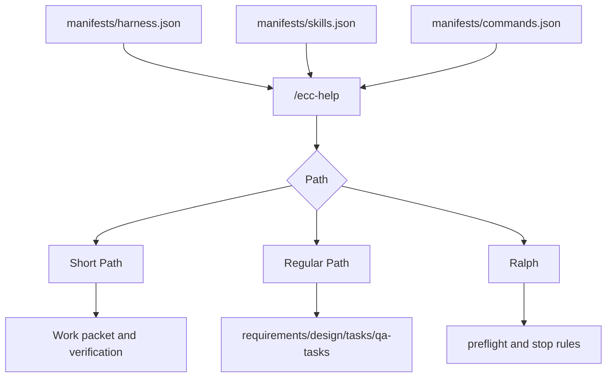
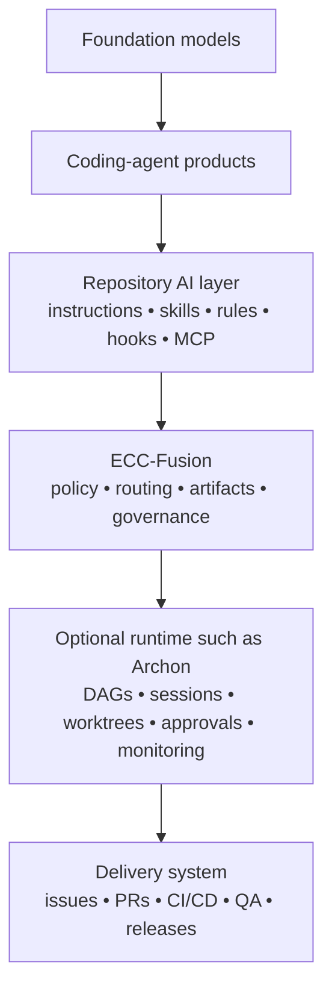

# Harness Ecosystem

The Harness Ecosystem is the ECC-Fusion backbone that powers, controls, and regulates paths, phases, skill relations, commands, rules, planning artifacts, model routing, and validation.

## Backbone



## Runtime Boundary

ECC-Fusion owns the engineering methodology and policy layer. It defines route selection, artifact contracts, work-packet boundaries, skill governance, model-tier policy, verification rules, escalation, and lifecycle semantics.

General-purpose execution-runtime capabilities should be integrated through an optional runtime such as Archon rather than reimplemented inside ECC-Fusion. This includes DAG scheduling, fresh-session orchestration, isolated worktrees, deterministic script nodes, parallel execution, approval pauses, workflow monitoring, and remote adapters.

ECC remains the compatibility and distribution base. Archon-backed execution is optional; ECC-Fusion standalone mode must remain usable with compatible coding agents and explicit commands.



See [`docs/archon-integration-strategy.md`](archon-integration-strategy.md) for the detailed comparison, reinvention guardrails, Mermaid diagrams, semantic mapping, and phased integration roadmap.

## Reinvention Guardrail

Before adding an orchestration feature, ask whether it is:

1. a policy, lifecycle, artifact, routing, or governance requirement that belongs in ECC-Fusion; or
2. a general-purpose execution-runtime capability that should be integrated or reused.

ECC-Fusion should not independently become a second generic DAG engine, worktree scheduler, monitoring dashboard, or multi-platform adapter framework unless a requirement cannot be met through integration.

## Integrity Rules

- Keep executable skills in `skills/` and executable commands in `commands/`.
- Keep generated human catalogs in `ecosystem/`.
- Keep path, phase, orchestration, and Kiro artifact relations in `manifests/harness.json`.
- Validate all new skills against category, source, prerequisite, conflict, and path availability rules.
- Do not add source-library skills only because they are famous; add them only when they fill a phase gap.
- Preserve ECC-Fusion standalone mode when adding optional runtime integrations.
- Prefer optional runtime adapters over rebuilding generic execution infrastructure.

## Validation

Run:

```powershell
node scripts/generate-ecosystem-catalog.mjs
npm.cmd test
npm.cmd run validate
```
