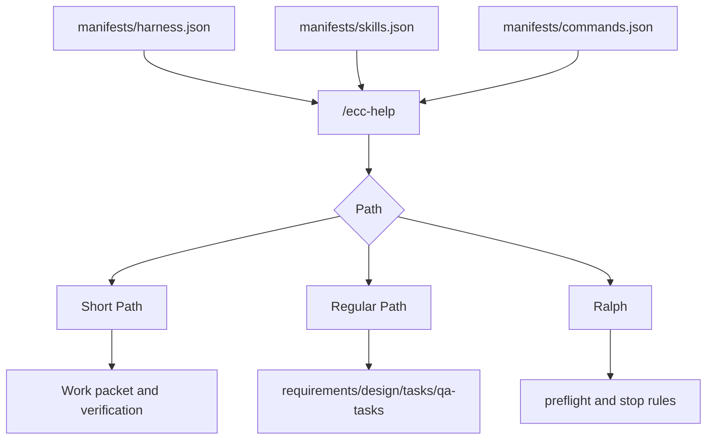

# Harness Ecosystem

The Harness Ecosystem is the ECC-Fusion backbone that powers, controls, and regulates paths, phases, skill relations, commands, rules, planning artifacts, model routing, and validation.

## Backbone



## Integrity Rules

- Keep executable skills in `skills/` and executable commands in `commands/`.
- Keep generated human catalogs in `ecosystem/`.
- Keep path, phase, orchestration, and Kiro artifact relations in `manifests/harness.json`.
- Validate all new skills against category, source, prerequisite, conflict, and path availability rules.
- Do not add source-library skills only because they are famous; add them only when they fill a phase gap.

## Validation

Run:

```powershell
node scripts/generate-ecosystem-catalog.mjs
npm.cmd test
npm.cmd run validate
```
