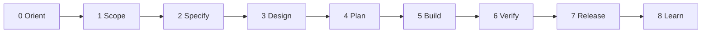
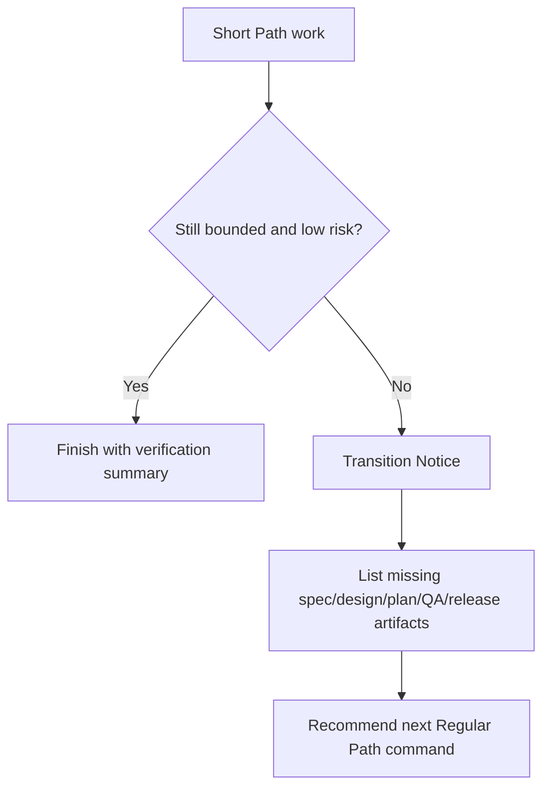

# Path Phase Map

ECC-Fusion uses one lifecycle across Short Path, Regular Path, Auto mode, and Ralph eligibility. The paths change artifact depth and evidence requirements; they do not create separate methodology stacks.

## Canonical Lifecycle



## Phase And Subphase Matrix

| Phase | Subphase | Short Path | Regular Path | Skills and commands |
| --- | --- | --- | --- | --- |
| Orient | Help and route | required route/risk check | required route/risk check | `/ecc-help`, `ecc-help` |
| Scope | Intent and boundaries | objective, allowed files | constraints, non-goals, stakeholders | `ask-interview`, `grill-with-context` |
| Specify | Requirements | lightweight acceptance criteria | spec/PRD and examples | `write-spec`, `prototype-ui` |
| Design | Architecture | only when risk requires it | architecture, ADRs, interfaces | `architecture-plan` |
| Plan | Work breakdown | one bounded packet | plan plus packet set | `create-work-packets`, `path-switch` |
| Build | Implementation | focused packet execution | plan-driven packet execution | `implement-work-packet`, `tdd` |
| Verify | Tests and review | focused verification | review, security, QA evidence | `verify-work`, `security-review` |
| Release | Ship and handoff | summary or handoff | release note and deployment evidence | `ship-release`, `handoff` |
| Learn | Retro and governance | optional lesson capture | reusable improvements | `retro-learn`, `skill-lint` |

## Promotion Checklist



## Validation

Run:

```powershell
npm.cmd test
npm.cmd run validate
```
