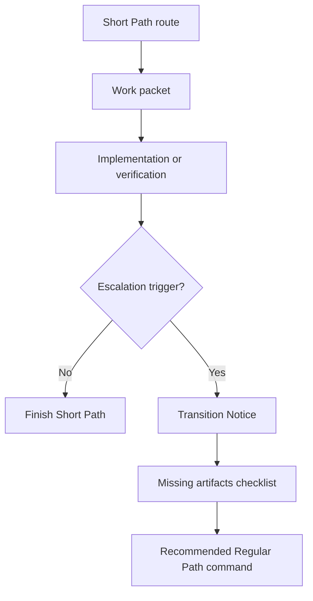

# Path Switching

Path switching lets ECC-Fusion start fast and still become fully governed when the work demands it.

## Promotion Flow



## Required Behavior

- Preserve useful evidence when promoting from Short Path to Regular Path.
- Do not create missing Regular Path prerequisites silently unless the user asked for artifact generation.
- Apply ECC-Fusion contracts over conflicting source-library guidance unless the user explicitly overrides them.

## Validation

Run:

```powershell
npm.cmd test
npm.cmd run validate
```
