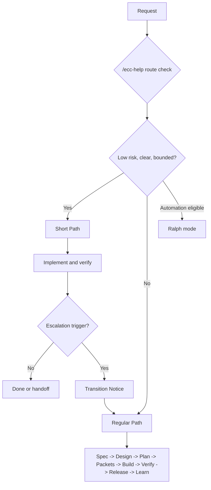

# ECC-Fusion Paths

ECC-Fusion has two primary paths and one advisory auto-selection mode. The paths are not separate prompt stacks; they are different rigor levels inside the same lifecycle documented in `docs/path-phase-map.md`.

## Short Path

Use Short Path for bounded, low-risk, low-ambiguity work. It still requires a route/risk check, a work packet, focused implementation, verification evidence, and escalation rules.

Short Path is valid when:

- the goal is clear,
- the blast radius is narrow,
- the change is reversible,
- tests or checks are known,
- no architecture, security, dependency, data, public API, or release boundary is crossed.

## Regular Path

Use Regular Path for ambiguous, high-risk, multi-phase, production-sensitive, architecture-sensitive, security-sensitive, dependency-sensitive, or release-sensitive work.

Regular Path exists to produce enough shared understanding before implementation: spec, design/architecture when needed, plan, work packets, review, QA, release, and learning artifacts.

## Auto Mode

Auto mode asks `/ecc-help` to inspect user intent, repository state, risk, ambiguity, artifacts, source precedence, and prerequisites. It then emits a route note with the recommended path, phase, next artifact, and next command.

Auto mode must explain decisions. It is not magic routing.

## Path Selection Diagram



## Decision Matrix

| Intent | Risk | Ambiguity | Required artifacts | Selected route | Fallback |
| --- | --- | --- | --- | --- | --- |
| Bounded bug fix | Low | Low | Work packet, tests | Short Path | Regular Path if scope grows |
| Ambiguous product request | Medium/High | High | Spec, architecture, plan | Regular Path | `/ecc-help` explains missing inputs |
| PRD/spec request | Medium | Medium/High | Requirements and spec | Regular Path | Ask interview/grill first |
| Architecture request | High | Medium | Domain docs, ADRs, constraints | Regular Path | Ask interview/grill first |
| Code review | Medium/High | Medium | Diff, scope, tests | Shared review skill | Transition Notice if artifacts missing |
| Test generation | Low/Medium | Low/Medium | Target behavior and test command | Shared test skill | Clarify-lite if behavior unclear |
| Explicit skill invocation | Varies | Varies | Skill prerequisites | Invoked skill | Transition Notice or refusal |
| Conflicting source-library guidance | Medium | High | Source map and repo instructions | Regular Path | Transition Notice before adopting external guidance |
| Missing prerequisites | Medium | High | State and required artifacts | Auto | `/ecc-help` lists blockers |
| Unsupported install/tool | High | Medium | Install contract and managed-file boundary | Regular Path | Stop on unsafe overwrite |
| Ralph request | Low only | Low | Bounded packet and feedback loop | Ralph | Redirect to packetize or Regular Path |
| Install/repair/upgrade | Medium/High | Medium | Backup, dry run, conflict report | Regular Path | Stop on unsafe overwrite |
| Duplicate skill name | Medium | Low | Skill manifest | Shared lint skill | Transition Notice until manifest is clean |
| Duplicate command alias | Medium | Low | Command manifest | Shared lint skill | Transition Notice until manifest is clean |
| Stale manifest entry | Medium | Low | Manifest and filesystem | Shared package check | Transition Notice until package check passes |
| Missing source attribution | Medium | Low | Source-library map and manifests | Shared lint skill | Transition Notice until attribution is restored |

## Junior And Senior Defaults

| User type | Default front door | What they need | What ECC-Fusion should show |
| --- | --- | --- | --- |
| First-time spec-driven user | `/ecc-help` | one next action | recommended path, phase, next command, missing artifacts |
| Junior developer | `/ecc-help` or `/ecc-start-feature` | guardrails and examples | acceptance criteria, allowed files, tests, escalation triggers |
| Experienced developer | direct path or command | low-friction control | exact contract, required artifacts, verification gates |
| Experienced AI/vibe-coding user | direct skill/path plus `/ecc-next` | fast recovery from drift | source precedence, route rationale, promotion checklist |

## Validation

Run:

```powershell
npm.cmd test
npm.cmd run validate
```
