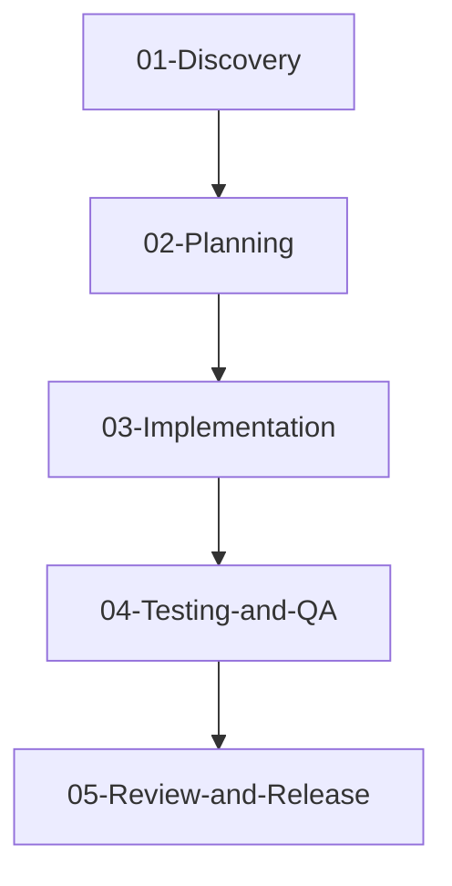

# Phases and Skills

The ECC-Fusion workflow adopts a "Vibe Coding" aligned structure. Skills are organized chronologically to map to the natural software development lifecycle, and orchestrated through the `orchestration` framework.

## The Vibe Coding Stages

### 1. Discovery & Clarification
**Folder:** `skills/01-Discovery`
This phase clarifies user intent, asks aggressive questions, and formalizes raw ideas into the `REQUIREMENTS.md` file.
*Key Skills:* `ecc-help`, `ask-interview`, `grill-with-context`, `write-spec`

### 2. Architecture & Planning
**Folder:** `skills/02-Planning`
This phase builds technical designs based on the Requirements. It generates the `DESIGN/` folder containing `ARCHITECTURE.md` and `PLAN.md`.
*Key Skills:* `architecture-plan`, `create-work-packets`, `prototype-ui`

### 3. Implementation & Execution
**Folder:** `skills/03-Implementation`
This phase executes the plans. It interacts tightly with the `TASKS.md` file, checking off items as it goes and requesting developer input for optional tasks.
*Key Skills:* `implement-work-packet`, `tdd`, `ralph-loop`

### 4. Testing & QA
**Folder:** `skills/04-Testing-and-QA`
This phase verifies that the code functions as expected and matches the Acceptance Criteria defined in the early phases.
*Key Skills:* `verify-work`, `write-tests`, `diagnose`, `qa-browser`

### 5. Review & Release
**Folder:** `skills/05-Review-and-Release`
This phase handles the final audit, checks for security flaws, ships the code, and writes a retro on the lessons learned.
*Key Skills:* `review-oss-output`, `security-review`, `ship-release`, `retro-learn`, `handoff`

## Orchestration
**Folder:** `orchestration/`
The backbone of ECC-Fusion. This includes `path-switch`, `transition-guard`, `skill-lint`, and `package-check`. These commands manage state and enforce governance rules across all phases.
