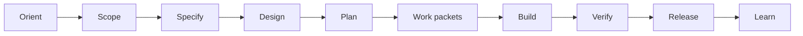

# Regular Path

Regular Path is ECC-Fusion's governed spec-driven track for ambiguous, larger, higher-risk, multi-phase, production-sensitive, architecture-sensitive, security-sensitive, dependency-sensitive, or release-sensitive work.

## Full Flow



## Required Behavior

- Preserve ECC compatibility.
- Apply source-of-truth precedence.
- Produce enough artifacts to make implementation auditable.
- Keep each implementation step bound by work packets.
- Verify claims with tests, checks, review evidence, QA evidence, or documented limitations.
- Emit a Transition Notice when a requested action skips required prerequisites.

## Validation

Run:

```powershell
npm.cmd test
npm.cmd run validate
```
