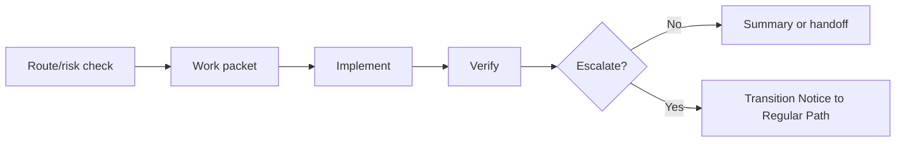

# Short Path

Short Path is ECC-Fusion's fast verified track for bounded, low-risk, low-ambiguity work. It is not YOLO mode and it is not a smaller copy of Regular Path.

## Minimum Flow



## Required Behavior

- Preserve ECC compatibility.
- Apply source-of-truth precedence.
- Create or identify a work packet before implementation.
- Verify claims with tests, checks, or documented evidence.
- Emit a Transition Notice when prerequisites are missing or risk grows.

## Escalation Triggers

Promote to Regular Path for unclear requirements, cross-module work, architecture, public API, data, security, dependency, release impact, missing verification, repeated failure, source-library conflict, or user confusion.

## Validation

Run:

```powershell
npm.cmd test
npm.cmd run validate
```
