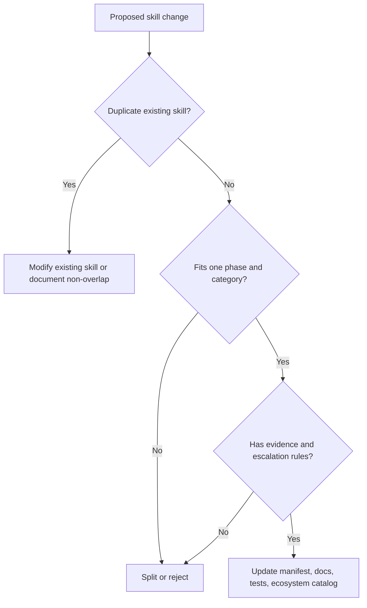

# Skill Extension Guide

Use this guide before modifying an existing ECC-Fusion skill or inserting a new skill into the Harness Ecosystem.

## Modification Rules

1. Identify the lifecycle phase and primary category first.
2. Search existing skills for overlapping purpose, trigger, inputs, outputs, and source inspiration.
3. Prefer modifying an existing skill over adding a near-duplicate.
4. Define path availability, prerequisites, conflicts, required evidence, and escalation rules.
5. Update `manifests/skills.json`, source attribution, and generated ecosystem maps.
6. Add or update tests before claiming the harness is intact.

## New Skill Checklist

- [ ] The skill fills a real phase/category gap.
- [ ] The skill has a repeatable workflow, not a one-off prompt.
- [ ] The skill will reduce confusion or repeated failure.
- [ ] The skill does not bloat context by loading irrelevant docs.
- [ ] The skill has clear inputs, outputs, evidence, and escalation rules.
- [ ] The source or GitHub library inspiration is listed.
- [ ] The ecosystem catalog was regenerated.

## Guardrails



## Validation

Run:

```powershell
node scripts/generate-ecosystem-catalog.mjs
npm.cmd test
npm.cmd run validate
```
