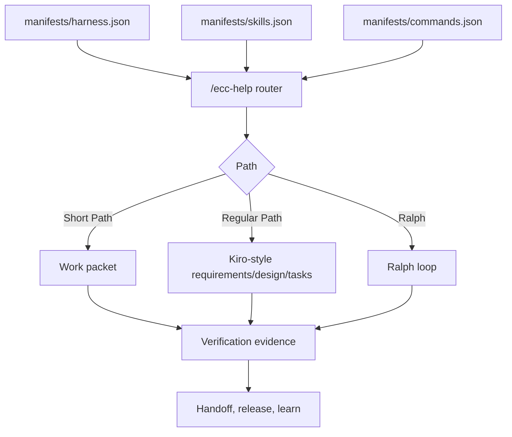

# ECC-Fusion Ecosystem Catalog

This catalog is generated from the canonical manifests and local skill, command, and rule files. It gives maintainers and users a stable way to inspect the Harness Ecosystem without moving the executable surfaces.

## Backbone



## Generated Areas

- `ecosystem/skills/MAP.md`: all skills grouped by category.
- `ecosystem/skills/<category>/MAP.md`: category-specific skill map and generated markdown mirrors.
- `ecosystem/orchestration/MAP.md`: commands, controller skills, and workflow rules that regulate paths and skill relations.

## Counts

| Surface | Count |
| --- | ---: |
| Skills | 24 |
| Commands | 28 |
| Categories | 13 |
| Harness phases | 11 |
| Orchestration rules | 10 |

Regenerate with:

```powershell
node scripts/generate-ecosystem-catalog.mjs
```
