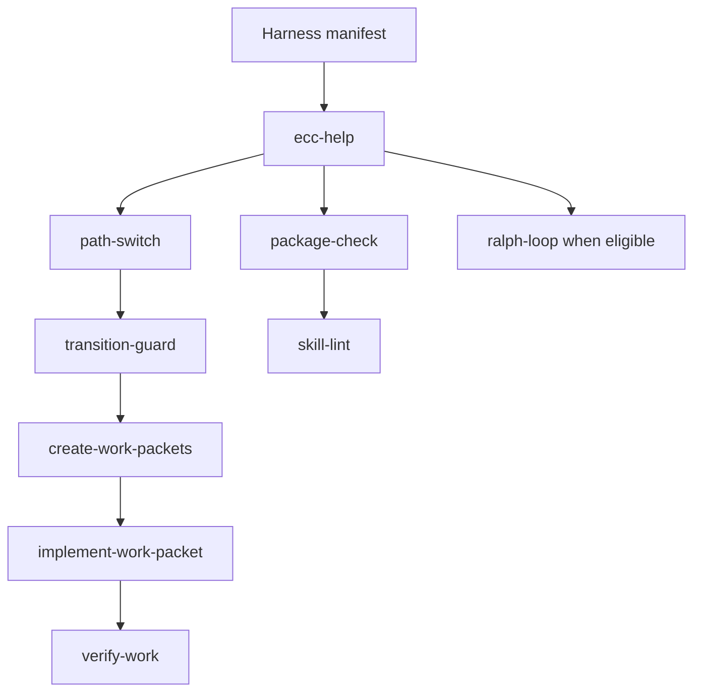

# Orchestration Map

## 🟢 For Users
This section controls how ECC-Fusion guides you. It maps the commands you type (like `/ecc-help`) to the hidden logic that keeps your project safe.

## 🔴 For Maintainers
This folder mirrors the commands, controller skills, and workflow rules that keep Short Path, Regular Path, Auto mode, Ralph mode, and skill relations coherent.

## Controller Diagram

## Commands

| Command | Category | Related skill | Paths | State required | Source or GitHub library | Mirror |
| --- | --- | --- | --- | --- | --- | --- |
| `/ecc-start` | Discovery & Help | `ecc-help` | Short Path, Regular Path, Auto | no | ECC | commands/ecc-start.md |
| `/ecc-start-feature` | Discovery & Help | `ecc-help` | Short Path, Regular Path, Auto | no | ECC | commands/ecc-start-feature.md |
| `/ecc-help` | Discovery & Help | `ecc-help` | Short Path, Regular Path, Auto | no | BMAD-METHOD, ECC | commands/ecc-help.md |
| `/ecc-path-short` | Work Packet & Delegation | `path-switch` | Short Path, Regular Path, Auto | yes | GSD Redux, ECC | commands/ecc-path-short.md |
| `/ecc-path-regular` | Architecture & Planning | `path-switch` | Short Path, Regular Path, Auto | yes | BMAD-METHOD, ECC | commands/ecc-path-regular.md |
| `/ecc-switch-path` | Work Packet & Delegation | `path-switch` | Short Path, Regular Path, Auto | yes | GSD Redux, ECC | commands/ecc-switch-path.md |
| `/ecc-next` | Discovery & Help | `ecc-help` | Short Path, Regular Path, Auto | yes | GSD Redux, ECC | commands/ecc-next.md |
| `/ecc-status` | Discovery & Help | `ecc-help` | Short Path, Regular Path, Auto | yes | ECC | commands/ecc-status.md |
| `/ecc-packetize` | Work Packet & Delegation | `create-work-packets` | Short Path, Regular Path, Auto | yes | GSD Redux, ECC | commands/ecc-packetize.md |
| `/ecc-route` | Work Packet & Delegation | `path-switch` | Short Path, Regular Path, Auto | yes | ECC | commands/ecc-route.md |
| `/ecc-execute-packet` | Implementation | `implement-work-packet` | Short Path, Regular Path, Auto | yes | GSD Redux, ECC | commands/ecc-execute-packet.md |
| `/ecc-verify` | Testing & Verification | `verify-work` | Short Path, Regular Path, Auto | yes | Superpowers, Matt Pocock skills, ECC | commands/ecc-verify.md |
| `/ecc-review` | Review & Security | `review-oss-output` | Short Path, Regular Path, Auto | yes | gstack, ECC | commands/ecc-review.md |
| `/ecc-security-review` | Review & Security | `security-review` | Short Path, Regular Path, Auto | yes | gstack, ECC | commands/ecc-security-review.md |
| `/ecc-qa` | QA & Release | `qa-browser` | Short Path, Regular Path, Auto | yes | gstack, ECC | commands/ecc-qa.md |
| `/ecc-ship` | QA & Release | `ship-release` | Short Path, Regular Path, Auto | yes | gstack, ECC | commands/ecc-ship.md |
| `/ecc-retro` | Documentation & Handoff | `retro-learn` | Short Path, Regular Path, Auto | yes | gstack, ECC | commands/ecc-retro.md |
| `/ecc-package-check` | Governance & Maintenance | `package-check` | Short Path, Regular Path, Auto | no | OpenSpec, ECC | commands/ecc-package-check.md |
| `/ecc-skill-lint` | Governance & Maintenance | `skill-lint` | Short Path, Regular Path, Auto | no | OpenSpec, ECC | commands/ecc-skill-lint.md |
| `/ecc-ralph-prepare` | Automation Accelerators | `ralph-loop` | Ralph | yes | Ralph, ECC | commands/ecc-ralph-prepare.md |
| `/ecc-ralph-run` | Automation Accelerators | `ralph-loop` | Ralph | yes | Ralph, ECC | commands/ecc-ralph-run.md |
| `/ecc-ralph-status` | Automation Accelerators | `ralph-loop` | Ralph | yes | Ralph, ECC | commands/ecc-ralph-status.md |
| `/ecc-ralph-stop` | Automation Accelerators | `ralph-loop` | Ralph | yes | Ralph, ECC | commands/ecc-ralph-stop.md |

## Controller Skills

| Skill | Name | Category | Description | Source or GitHub library | Mirror |
| --- | --- | --- | --- | --- | --- |
| `ecc-help` | ECC Help | Discovery & Help | Recommend the next safe ECC-Fusion route when the user is unsure, when path choice is ambiguous, or when a requested skill may be blocked by missing prerequisites. | BMAD-METHOD, ECC, Agent OS | skills/ecc-help.md |
| `create-work-packets` | Create Work Packets | Work Packet & Delegation | Provide the Create Work Packets workflow in the ECC-Fusion routed system. | GSD Redux, ECC | skills/create-work-packets.md |
| `implement-work-packet` | Implement Work Packet | Implementation | Provide the Implement Work Packet workflow in the ECC-Fusion routed system. | GSD Redux, ECC | skills/implement-work-packet.md |
| `verify-work` | Verify Work | Testing & Verification | Provide the Verify Work workflow in the ECC-Fusion routed system. | Superpowers, Matt Pocock skills, ECC | skills/verify-work.md |
| `review-oss-output` | Review OSS Output | Review & Security | Provide the Review OSS Output workflow in the ECC-Fusion routed system. | gstack, ECC | skills/review-oss-output.md |
| `security-review` | Security Review | Review & Security | Provide the Security Review workflow in the ECC-Fusion routed system. | gstack, ECC | skills/security-review.md |
| `skill-lint` | Skill Lint | Governance & Maintenance | Provide the Skill Lint workflow in the ECC-Fusion routed system. | OpenSpec, ECC | skills/skill-lint.md |
| `package-check` | Package Check | Governance & Maintenance | Provide the Package Check workflow in the ECC-Fusion routed system. | OpenSpec, ECC | skills/package-check.md |
| `handoff` | Handoff | Documentation & Handoff | Provide the Handoff workflow in the ECC-Fusion routed system. | Superpowers, Matt Pocock skills, ECC | skills/handoff.md |
| `path-switch` | Path Switch | Work Packet & Delegation | Provide the Path Switch workflow in the ECC-Fusion routed system. | GSD Redux, ECC | skills/path-switch.md |
| `transition-guard` | Transition Guard | Work Packet & Delegation | Provide the Transition Guard workflow in the ECC-Fusion routed system. | GSD Redux, ECC | skills/transition-guard.md |
| `ralph-loop` | Ralph Loop | Automation Accelerators | Provide the Ralph Loop workflow in the ECC-Fusion routed system. | Ralph, ECC | skills/ralph-loop.md |

## Workflow Rules

| Rule | Canonical file |
| --- | --- |
| `global-engineering-rules` | rules/global-engineering-rules.md |
| `security-rules` | rules/security-rules.md |
| `testing-rules` | rules/testing-rules.md |
| `oss-worker-rules` | rules/oss-worker-rules.md |
| `high-end-reviewer-rules` | rules/high-end-reviewer-rules.md |
| `dependency-rules` | rules/dependency-rules.md |
| `context-management-rules` | rules/context-management-rules.md |
| `skill-governance-rules` | rules/skill-governance-rules.md |
| `path-switching-rules` | rules/path-switching-rules.md |
| `ralph-safety-rules` | rules/ralph-safety-rules.md |

## Modification Guard

Any change to commands, controller skills, rules, or `manifests/harness.json` must keep these invariants:

- every path has an entry and escalation rule,
- every phase maps to at least one category,
- every controller skill exists in `manifests/skills.json`,
- every command references an existing skill,
- every rule mirror points to an existing canonical rule.

Harness paths: Short Path, Regular Path, Auto, Ralph.
