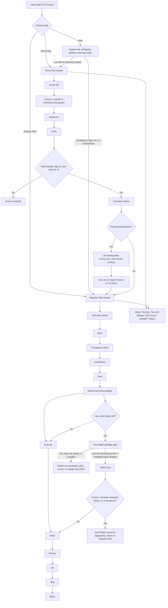
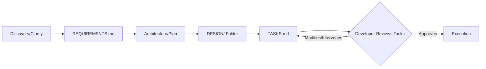

# Orchestration Workflow Diagrams

This document visually represents the transition flows and routing rules for the ECC-Fusion library.

## Short Path vs Regular Path

## Kiro Pipeline (Planning & Intervention)

