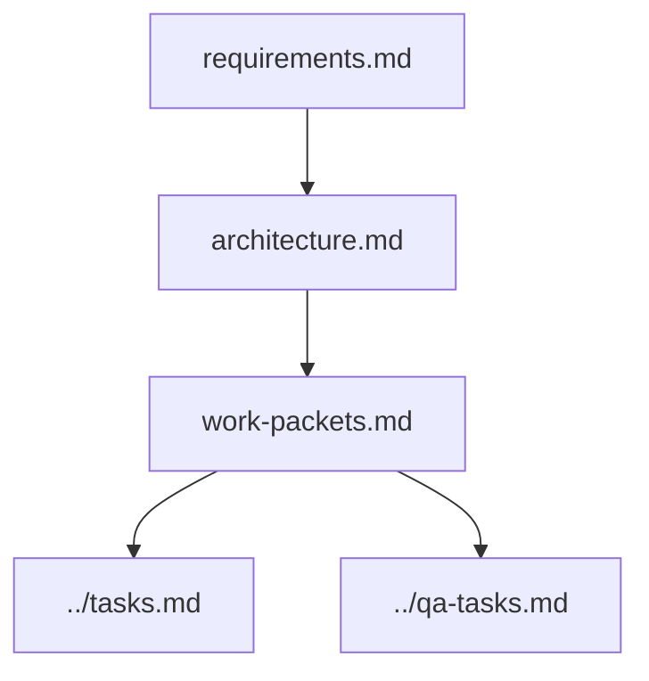

# Design

## Why This Exists

This document exists to guide you smoothly without overwhelming bureaucracy. It is designed to be a living, conversational document.

## Purpose

The design folder shows how Architecture & Planning, Work Packet & Delegation, and related skills converted requirements into an implementation strategy.

## Contents

- `architecture.md`: architecture, interfaces, risks, and decisions.
- `work-packets.md`: implementation slices, allowed files, dependencies, and verification commands.

## Diagram

## Verification

- [ ] Architecture decisions link back to requirements.
- [ ] Work packets link forward to tasks and QA tasks.

## Blockers

- Missing architecture direction for risky work.
- Work packets that cannot be traced to requirements.
